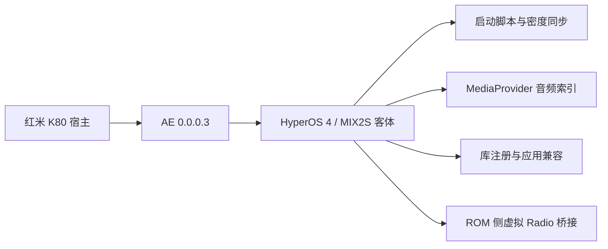
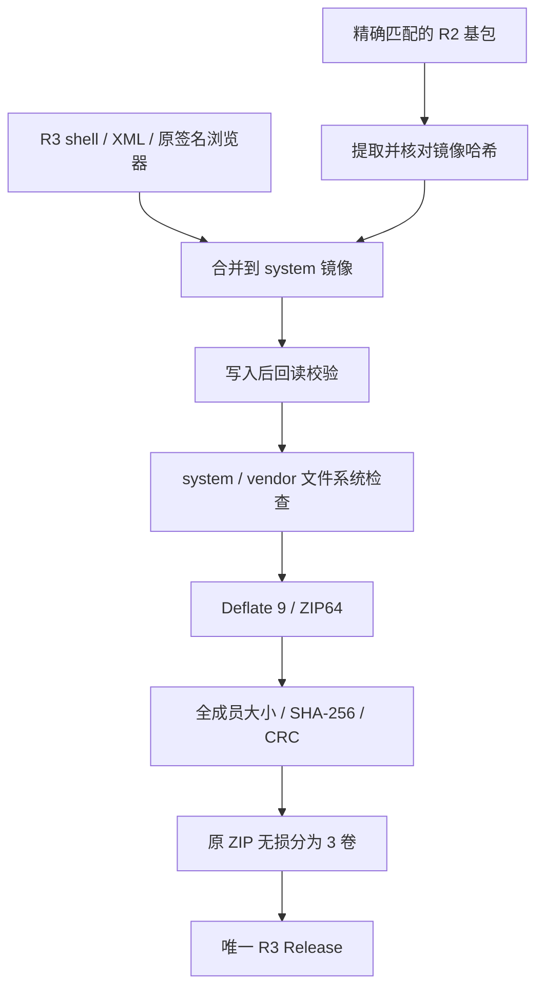

# 运行边界与构建链路

```mermaid
flowchart LR
    Host[红米 K80 宿主] --> AE[AE 0.0.0.3]
    AE --> Guest[HyperOS 4 / MIX2S 客体]
    Guest --> Boot[启动脚本与密度同步]
    Guest --> Media[MediaProvider 音频索引]
    Guest --> Apps[库注册与应用兼容]
    Guest --> Radio[ROM 侧虚拟 Radio 桥接]
```

所有修复落在客体 ROM。宿主手机的真实电话服务、真实 SIM、AE APK 均不是修改目标。模拟信号和来电功能通过 AE 既有通道连接到 ROM 侧兼容层。

```mermaid
flowchart TD
    Base[精确匹配的 R2 基包] --> Hash[提取并核对镜像哈希]
    Payload[R3 shell / XML / 原签名浏览器] --> Merge[合并到 system 镜像]
    Hash --> Merge
    Merge --> Readback[写入后回读校验]
    Readback --> Fsck[system / vendor 文件系统检查]
    Fsck --> Zip[Deflate 9 / ZIP64]
    Zip --> Verify[全成员大小 / SHA-256 / CRC]
    Verify --> Parts[原 ZIP 无损分为 3 卷]
    Parts --> Release[唯一 R3 Release]
```

图中 R2 原生组件由基包继承。本仓库的源文件不足以从原厂 ROM 重建整个 R2；参数化打包工具需要匹配清单的既有 R2 输入。
